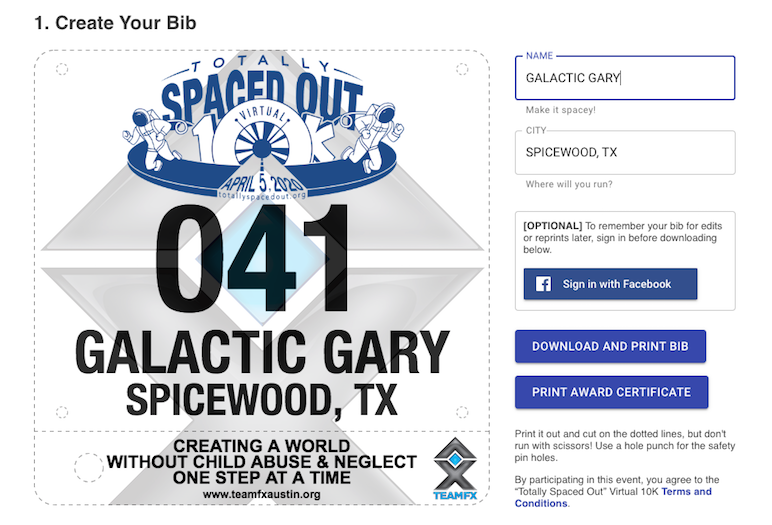
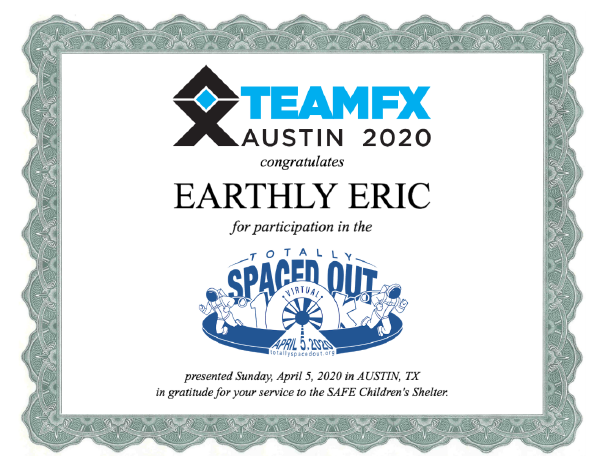

# 'Totally Spaced Out' Virtual 10K - Race Bib Generator

A print-at-home race bib generator in the time of COVID-19.



## About This
The 43rd Annual Austin-American Statesman Cap10K scheduled for April 5, 2020 was cancelled due to the coronavirus, but Coach Gary came up with a brilliant idea: to organize a safe, alternative virtual race that our [running team][teamfx-donate] members &ndash; spaced at least 6 feet apart &ndash; could run or walk wherever they are.

But what's a race without an official bib number to wear and celebrate in your selfies at the virtual finish line?

So we built this [bib generator site][tso] just a few days before the event, and invited the whole community to participate. The event raised over $6,000 for the [SAFE Austin Children's Shelter][safe].

We hope this success will inspire similar efforts on behalf of those in need in your community, too.

### Built with
* [React](https://reactjs.org/)
* [Google Firebase][firebase], [Analytics][analytics], and [Hosting][firebase-hosting]
* [Facebook Login][facebook-login]
* [Fabric.js][fabric] Javascript Canvas Library

## Getting Started
The code in this repo is built around a specific event but can be easily modified to support a virtual race or similar event of your own.

By default, the web app:
* generates a printable bib (PNG) with unique bib number, participant name, and city
* outputs an award certificate (PDF) when the event is complete
* logs bib entries in a Firebase Realtime Database
* displays an animated slider listing random participants

### Prerequisites
* (optional) [Facebook Developer Account][facebook-app-dev] and Application ID
* Familiarity with [Fabric.js][fabric] is helpful but not required

### Installation
1. Set up a free [Firebase account][firebase] and start a new Firebase project.
2. Create a new Firebase [Realtime Database][firebase-rtdb] and set up [rules][firebase-rules].
3. Install the [Firebase CLI][firebase-cli].
4. Set up [Firebase Hosting][firebase-hosting].
5. Clone this repo.
```sh
git clone https://github.com/ahtraddis/totallyspacedout.git
```
6. Install NPM packages
```sh
npm install
```

### Customization
1. Edit the `defaults` and `firebaseConfig` objects in `App.js` to suit your event and Firebase configuration:
```JS
const defaults = {
    name: "YOUR DEFAULT NAME",
    city: "YOUR DEFAULT CITY",
    missionText: "YOUR SLOGAN OR MISSION STATEMENT",
    missionSubText: "www.yoursiteurl.com",
    baseFilename: "YourBibFilenamePrefix_",
    awardBaseFilename: "YourAwardCertificateFilename",
    tosUrl: "https://www.yoursiteurl.com/terms",
    privacyPolicyUrl: "https://yoursiteurl.com/privacy",
  };
...
const firebaseConfig = {
    apiKey: "YOUR-API-KEY",
    authDomain: "YOUR-AUTH-DOMAIN",
    databaseURL: "YOUR-DATABASE-URL",
    projectId: "YOUR-PROJECT-ID",
    storageBucket: "YOUR-STORAGE-BUCKET",
    messagingSenderId: "YOUR-SENDER-ID",
    appId: "YOUR-APP-ID",
    measurementId: "YOUR-MEASUREMENT-ID"
  };
```

2. Edit the following functions to modify the bib and award certificate layouts:

* `createBibGroup()` - generates a standard race bib outline
* `createTextGroup()` - generates bib number, name, and city fields
* `createTextGroup2()` - generates mission statement and site URL
* `addImages()` - adds logo images and thumbnails to canvas
* `addAwardElements()` - generates the award certificate PDF



See the [Fabric.js][fabric] docs for usage info.

3. Edit the HTML body, substituting your own event info, links, and images.

## Build
```sh
yarn build
```

## Deploy
```sh
firebase deploy
```

## Roadmap

This was created in just a few days, so next steps will be to clean up and abstract things to make it more easily reuseable for ongoing events. Let us know your ideas and needs and we'll try to incorporate them.

| Status | Milestone | ETA |
| :---: | :--- | :---: |
| | Abstract text, graphics and layouts via configurable templates | |
| | Add support for ongoing team/community events with the same participant base | |

## License

This project is licensed under the MIT License - see the [LICENSE](LICENSE) file for details.

If you appreciate and benefit from this project, please consider making a tax-deductible donation to SAFE Austin via the [Team FX Donate page][teamfx-donate].

## Contact
Eric Schwartz - eric@whyanext.com

Project Link: [https://github.com/ahtraddis/totallyspacedout][repo]

## Acknowledgements
* [Team FX Austin][teamfx] and our amazing coach Gary Walker
* [SAFE Austin Children's Shelter][safe]
* [React Awesome Slider][react-awesome-slider]

---
This project was bootstrapped with [Create React App][cra].

[repo]: https://github.com/ahtraddis/totallyspacedout.git
[tso]: https://www.totallyspacedout.org
[safe]: https://www.safeaustin.org/
[teamfx]: https://www.teamfxaustin.org/
[teamfx-donate]: https://www.teamfxaustin.org/newsite/sponsor-a-runner/
[teamfx-tso]: https://www.teamfxaustin.org/newsite/totally-spaced-out-10k/
[cra]: https://github.com/facebook/create-react-app
[fabric]: https://fabricjs.com
[react-awesome-slider]: https://github.com/rcaferati/react-awesome-slider
[firebase]: https://firebase.google.com/
[firebase-cli]: https://firebase.google.com/docs/cli
[firebase-rtdb]: https://firebase.google.com/docs/database
[firebase-hosting]: https://firebase.google.com/docs/hosting/quickstart
[firebase-rules]: https://firebase.google.com/docs/database/security
[analytics]: https://marketingplatform.google.com/about/analytics/
[facebook-app-dev]: https://developers.facebook.com/docs/apps/
[facebook-login]: https://developers.facebook.com/docs/facebook-login/
